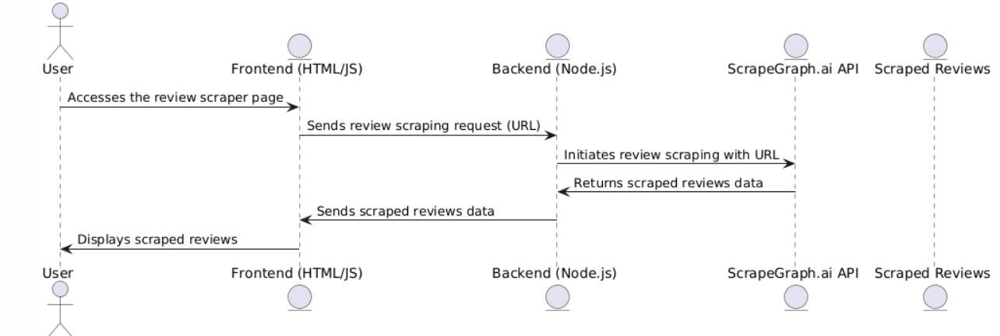
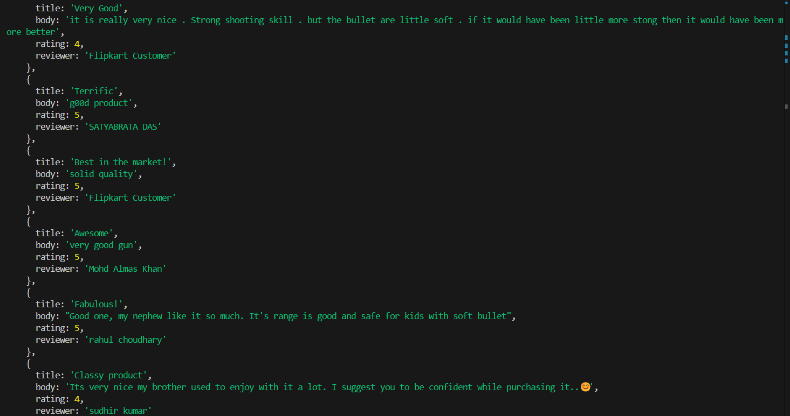
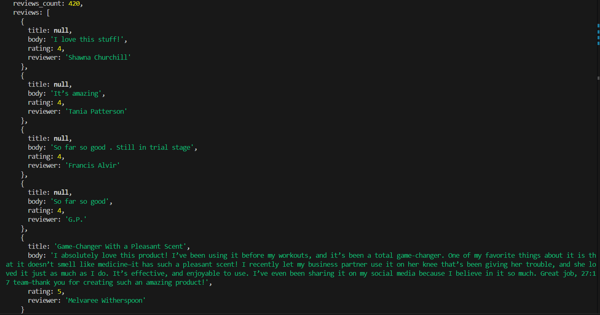
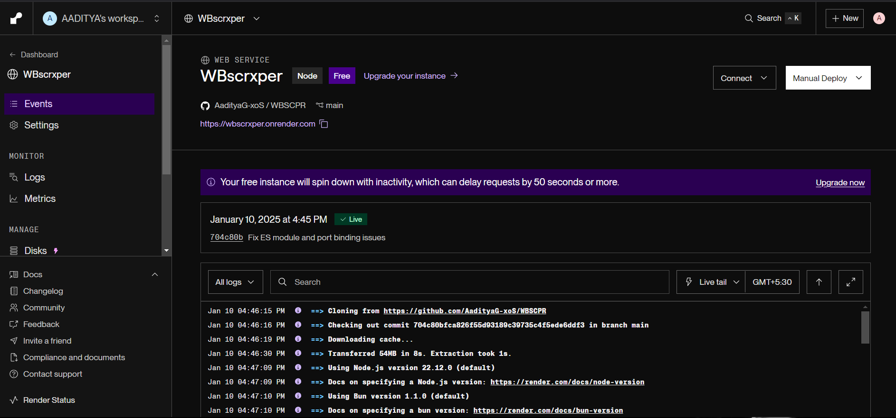
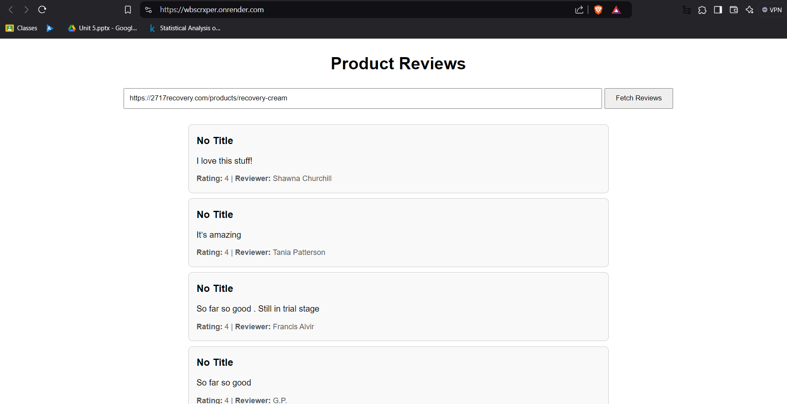
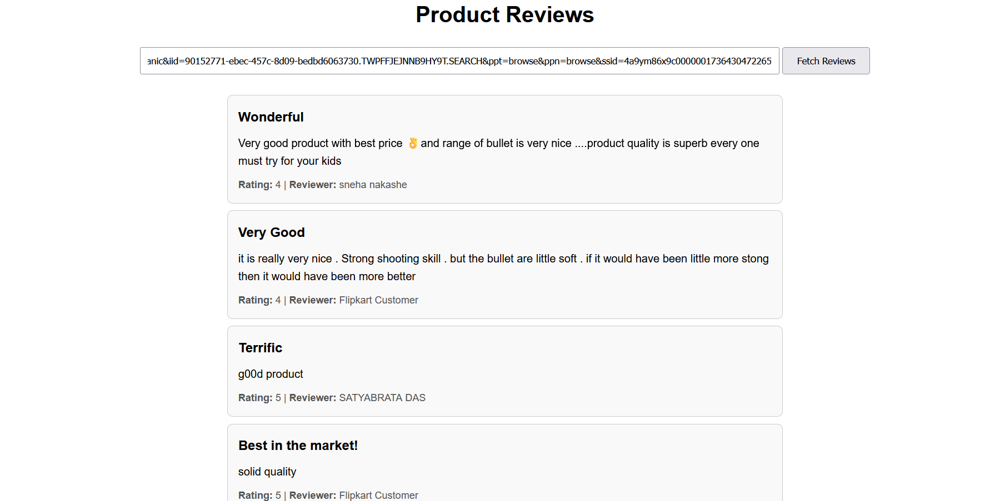

# WBSCPR : Reviews Scraper 

## Overview

Welcome to the **WBSCPR: Reviews Scraper**! This project utilizes **ScrapeGraph.ai**, **Node.js**, and **Render** to build a robust review scraping website that fetches product reviews from various e-commerce websites and displays them on a user-friendly interface. The project is designed to help businesses, researchers, or developers access aggregated reviews for analysis, insights, or feedback purposes.

The app leverages **ScrapeGraph.ai** for scraping data, **Node.js** for backend development, and **Render** for cloud deployment, offering a seamless experience with scalability, reliability, and ease of access.

---

## Features

### 1. **Dynamic Review Scraping**
   - Scrape product reviews from popular e-commerce websites in real-time.
   - Data is automatically aggregated and structured for easy consumption.

### 2. **Backend Powered by Node.js and Express**
   - Fast and lightweight API built using **Node.js**.
   - Simple and intuitive routes for scraping and serving data.
   - Serve dynamic content with minimal latency.

### 3. **Cloud Hosting on Render**
   - Hosted on **Render** for fast deployment and high availability.
   - Automatic scaling based on demand to ensure the app performs smoothly.

### 4. **API for Easy Integration**
   - Built-in API to fetch reviews, making it easy to integrate with other applications or tools.
   - Data can be used in analysis, reporting, or visualizations.

---

## Technologies Used

- **ScrapeGraph.ai**: Tool for web scraping that fetches product reviews data from e-commerce websites.
- **Node.js**: JavaScript runtime environment used to build the server and manage APIs.
- **Express**: A fast, unopinionated framework for building web applications with Node.js.
- **Render**: Cloud service platform for hosting web apps, ensuring ease of deployment and scaling.
- **dotenv**: Manage environment variables for API keys and configurations securely.

---

## System Architecture

The system follows a simple yet effective architecture:

- **Frontend (Client)**: The user interacts with the frontend, a simple web page.
- **Backend (Node.js)**: The Node.js server listens for API requests, initiates scraping via ScrapeGraph.ai, and processes the data before sending it to the frontend or external applications.
- **ScrapeGraph.ai**: This service fetches data (reviews) from e-commerce websites and returns it to the backend.
- **Render**: Hosts the backend application and ensures it is live and accessible to users.



---

## Project Setup

Follow these steps to set up and run the project locally or deploy it on Render.

### Prerequisites
- Node.js (preferably the latest version).
- Git (to clone the repository).
- A ScrapeGraph.ai account for the API key.

### Steps to Run Locally

 **Clone the repository**:
   ```bash
   git clone https://github.com/AadityaG-xoS/WBSCPR.git
   cd WBSCPR
   ```
**WBSCPR is also hosted at https://wbscrxper.onrender.com/ using Render**

### Output Images

Here are some sample outputs from the Review Scraper API:

JSON Reviews Response:

<<<<<<< HEAD


Deployment using Render:


A visualization of the scraped reviews, showing user ratings and feedback:


=======


Deployment using Render:


A visualization of the scraped reviews, showing user ratings and feedback:


>>>>>>> ab88f08ca4b454048036a54b8c9e817d42cf6cc5

###  Conclusion

This project demonstrates the power of web scraping using ScrapeGraph and Node.js, providing a simple yet effective API for scraping reviews from various websites. Deployed on Render, the app allows seamless and scalable scraping of product reviews.
  

 
